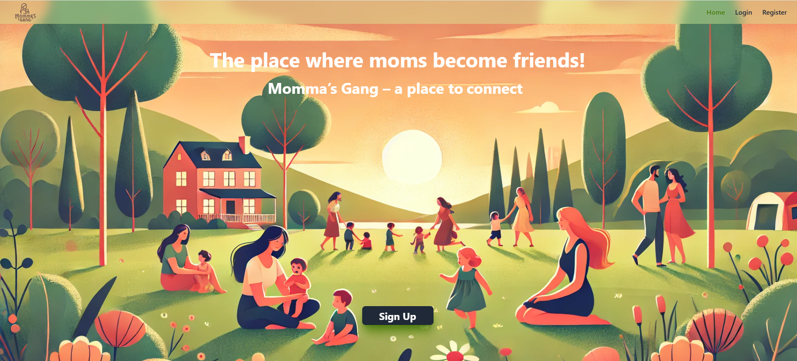
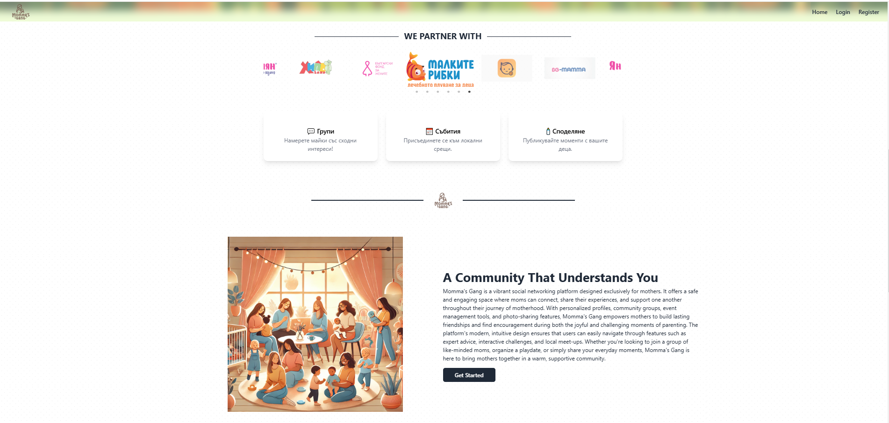
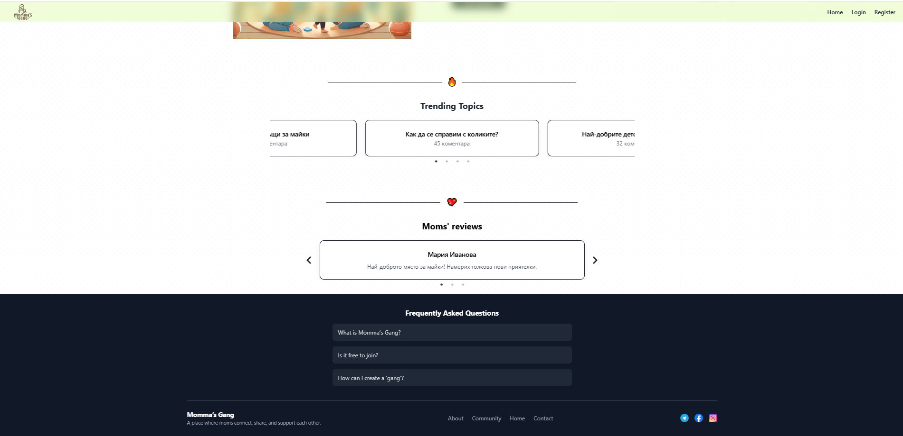

# Momma's Gang

Momma's Gang
This is a responsive React and Tailwind CSS project that I created as part of my final project for SoftUni. The project uses Vite and tailwindCSS.

Technologies Used
React
Tailwind CSS
Vite
react-typed
react-icons
framer-motion
post-css

Getting Started
To get a local copy up and running, follow these steps:

Clone the repository git clone https://github.com/dako-23/React-JS

Install dependencies npm install

Start the development server npm run dev

Open http://localhost:5173 to view it in the browser.

# Screenshots

# Desktop View

# Phone View

